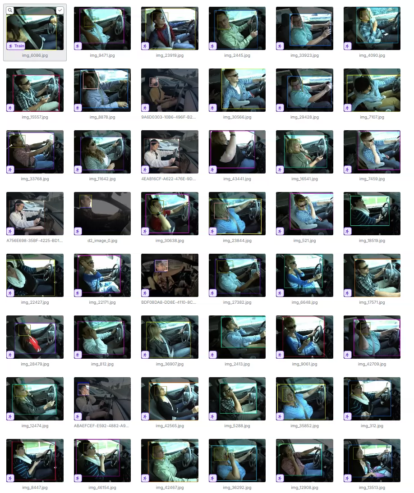
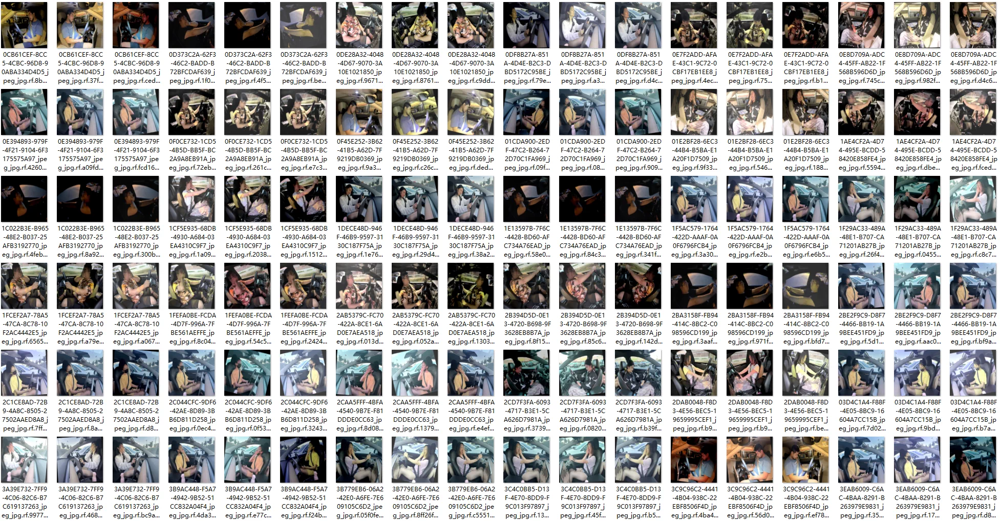
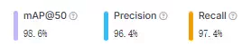
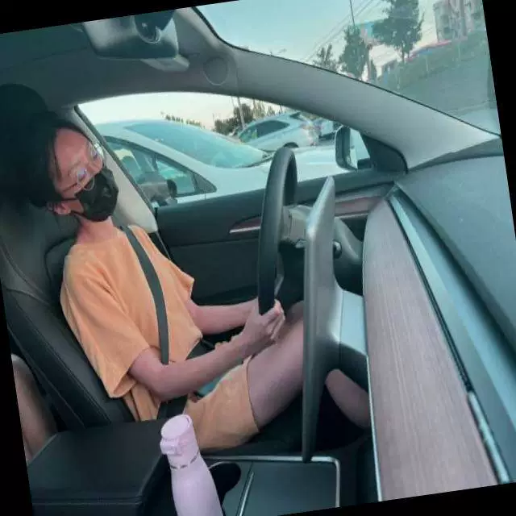
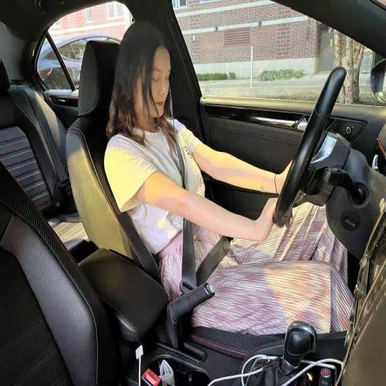
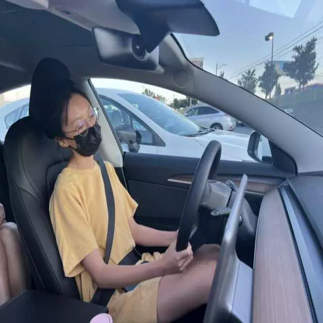

## Body

Driver Status Detection Dataset in YOLO format

Totally 22,584 images, all labeled and divided into training set, test set, and validation set.

Training set: 20,580 images, Test set: 1,004 images, Validation set: 1,000 images

The dataset is divided into 13 categories, namely: '0', 'c0 - Safe Driving', 'c1 - Texting', 'c2 - Talking on the phone', 'c3 - Operating the Radio', 'c4 - Drinking', 'c5 - Reaching Behind', 'c6 - Hair and Makeup', 'c7 - Talking to Passenger', 'd0 - Eyes Closed', 'd1 - Yawning', 'd2 - Nodding Off', 'd3 - Eyes Open'
       
                                ‘0’，‘c0 - 安全驾驶’，‘c1 - 发短信’，‘c2 - 打电话’，‘c3 - 操纵收音机’，‘c4 - 饮酒’，‘c5 - 后仰伸臂’，‘c6 - 理发化妆’，‘c7 - 和乘客交谈’，‘d0 - 眼睛闭上’，‘d1 - 打哈欠’，‘d2 - 睡着’，‘d3 - 眼睛睁开’

Electronic virtual products sold without return or exchange.

## Images

item_1046655826991

Here is a pay link on Stripe ( https://buy.stripe.com/3cs8yP7sY87d0vu9AB ). Please contact me lonlonago@foxmail.com after funding $89, and I will send you a complete data files , thank you!

